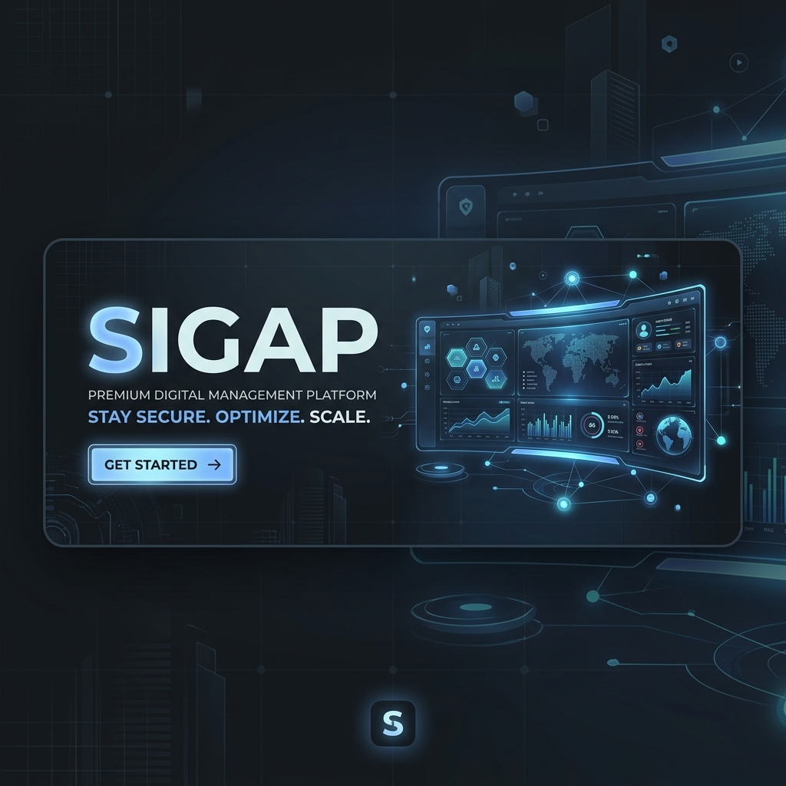
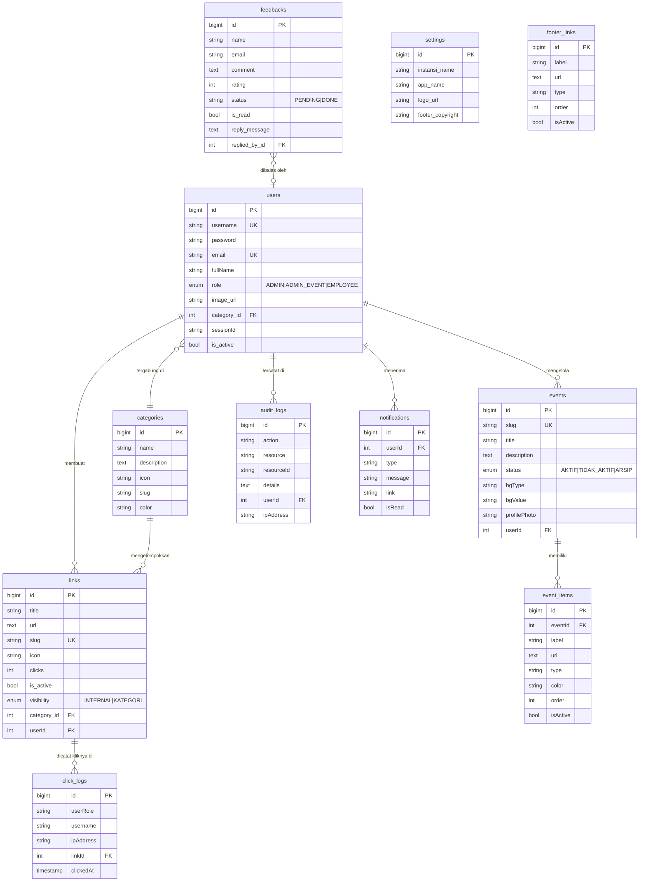
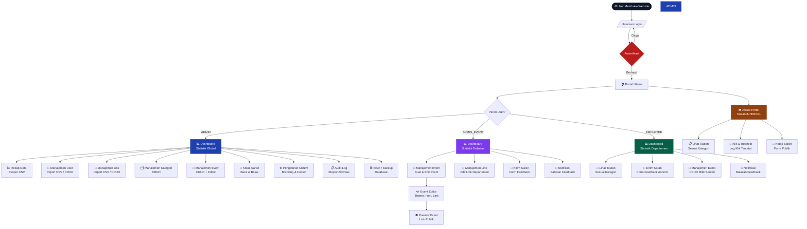

<div align="center">
  
  <br />
  
  
  
  
  
  
</div>

# 🛡️ SIGAP - Sistem Gerbang Akses Pintar (Laravel Monolith)

**SIGAP (Lite Edition)** adalah platform manajemen akses dan landing page terpadu yang didesain khusus untuk stabilitas tinggi di lingkungan shared hosting. Platform ini menggabungkan kecepatan **Vue 3 + Vite** dengan ketangguhan backend **Laravel Monolith**.

---

## 🛠️ TECHNOLOGICAL STACK

| Komponen | Teknologi | Versi | Keunggulan |
| :--- | :--- | :--- | :--- |
| **Runtime** | PHP | `^8.2` | Keamanan dan efisiensi memori terbaru. |
| **Backend** | **Laravel** | `^11.0` | Framework PHP tercanggih dengan ekosistem keamanan solid. |
| **Frontend** | **Vue.js** | `^3.4` | Reaktivitas instan dan performa UI yang sangat ringan. |
| **Build Tool** | **Vite** | `^6.0` | Proses *Hot Module Replacement* tercepat saat ini. |
| **Styling** | **Tailwind CSS** | `^4.0` | Desain modern dengan performa CSS *zero-runtime* yang bersih. |

---

## 📖 DAFTAR ISI
1. [VII. Diagram Database (ERD)](#-vii-diagram-database-erd)
2. [VIII. Diagram Alur Fitur Per Peran](#-viii-diagram-alur-fitur-per-peran-role)
3. [I. Panduan Peran (Role SOP)](#-i-panduan-peran-role-sop)
4. [II. Panduan Deployment (CI/CD)](#-ii-panduan-deployment-cicd)
5. [III. Manajemen Keamanan & Lisensi](#-iii-manajemen-keamanan--lisensi)
6. [IV. Fitur Unggulan (Backend Laravel)](#-iv-fitur-unggulan-backend-laravel)
7. [V. Panduan Instalasi & Maintenance](#-v-panduan-instalasi--maintenance)
8. [VI. Panduan Update (Post-Initial)](#-vi-panduan-update-post-initial)

---

## 🗺️ VII. DIAGRAM DATABASE (ERD)



---

## 👥 VIII. DIAGRAM ALUR FITUR PER PERAN (ROLE)



---

## 👥 I. PANDUAN PERAN (ROLE SOP)

### 📜 Keterangan Peran & Hak Akses

| Fitur | 👑 Admin | 🎭 Admin Event | 💼 Pegawai |
|---|:---:|:---:|:---:|
| Dashboard & Statistik Global | ✅ | ✅ (terbatas) | ✅ (terbatas) |
| Rekap Data CSV | ✅ | ❌ | ❌ |
| Manajemen User (CRUD + Import) | ✅ | ❌ | ❌ |
| Manajemen Kategori | ✅ | ❌ | ✅ |
| **Manajemen Link (CRUD)** | ✅ | ✅ | ✅ |
| **Manajemen Link (Bulk Import)** | ✅ | ❌ | ❌ |
| Manajemen Event (CRUD) | ✅ (semua) | ✅ (milik sendiri) | ✅ (milik sendiri) |
| Event Editor (Theme, Font, Link) | ✅ | ✅ | ✅ |
| Notifikasi (Bell / Riwayat) | ✅ | ✅ | ✅ |
| **Kirim Saran** ke Admin | ❌ | ✅ | ✅ |
| Kotak Saran (Baca & Balas) | ✅ | ❌ | ❌ |
| Audit Log & Ekspor Aktivitas | ✅ | ❌ | ❌ |
| Pengaturan Sistem & Branding | ✅ | ❌ | ❌ |
| Reset & Backup Database | ✅ | ❌ | ❌ |

> ℹ️ **Catatan Visibilitas Event di Panel Admin:**
> - 👑 **Admin**: Melihat **semua** event dari semua pengguna. Dapat mengedit/menghapus event siapapun.
> - 🎭 **Admin Event**: Melihat event milik sendiri + event dari pengguna **satu kategori / departemen** yang sama. Hanya dapat mengedit/menghapus event **milik sendiri**.
> - 💼 **Pegawai**: Melihat event milik sendiri + event dari pengguna **satu kategori** + semua event yang dibuat oleh **Admin Event** (event siaran / broadcast). Hanya dapat mengedit/menghapus event **milik sendiri**.

---

### 1. 👑 Super Admin (Sistem & Monitoring)
Bertanggung jawab atas stabilitas sistem, manajemen kebijakan pengguna, dan branding instansi.
- **Dashboard Utama**: Melihat anomali statistik dan total klik global.
- **Audit & Security**: Memeriksa **Audit Logs** secara berkala untuk memastikan tidak ada aktivitas mencurigakan.
- **Branding Control**: Mengatur logo, favicon, dan teks footer portal melalui menu pengaturan.
- **Role Control**: Super Admin mengelola seluruh struktur sistem, termasuk fitur Reset Database.

### 2. 🎭 Admin Event (Event Landing Creator)
Bertanggung jawab dalam merancang microsite event yang menarik dan fungsional.
- **Pembuatan Event**: Menentukan judul, deskripsi, dan slug unik untuk event.
- **Hybrid Editor SOP**:
    1. Atur tema warna (Background & Button).
    2. Pilih Google Font yang sesuai dengan branding event.
    3. Tambahkan link pendaftaran, brosur, atau media sosial.
    4. Atur urutan dengan drag-and-drop.
    5. Klik **Simpan** untuk menerapkan perubahan.
    6. Klik **Share** untuk menyalin link publik.
    7. Klik **Preview (Mata)** untuk melihat tampilan langsung di browser.

### 3. 💼 Pegawai (Manajemen Tautan Departemen)
Bertanggung jawab atas pembaruan link layanan di bawah departemennya.
- **Pembuatan Tautan**: Menggunakan slug yang deskriptif (Contoh: `sigap.id/s/form-pns`).
- **Analisis Kinerja**: Memantau grafik statistik klik pada tautan yang dikelola untuk evaluasi bulanan.
- **Manajemen Kategori**: Pegawai diizinkan mengelola kategori tautan untuk mengelompokkan layanan departemen mereka secara mandiri.

---

## 🚀 II. PANDUAN DEPLOYMENT (CI/CD)

### 🤖 TAHAP 1: KONFIGURASI GITHUB ACTIONS
Di GitHub -> **Settings** -> **Secrets and variables** -> **Actions**, tambahkan:
- `FTP_SERVER`, `FTP_USERNAME`, `FTP_PASSWORD`.
- `FTP_REMOTE_DIR` (Opsional): Pilih folder destinasi (Default: `./`).

### 👨‍🍳 TAHAP 2: ALUR BUILD & SYNC (OTOMATIS)
Setiap kali Anda menekan `git push origin master`, robot GitHub akan:
1. Menyiapkan lingkungan PHP 8.2 & Node.js 20.
2. Menginstall dependensi (Composer & NPM).
3. **Membangun Aset** secara otomatis (`npm run build`).
4. Menjalankan pemeriksaan sintaks kode.
5. Mengirimkan file matang ke hosting Anda.

---

## 📜 III. MANAJEMEN KEAMANAN & LISENSI

Sistem ini memiliki proteksi domain untuk mencegah penggunaan ilegal:

1. **Whitelisting**: Update variabel **`ALLOWED_DOMAINS`** di file `.env`.
   ```dotenv
   ALLOWED_DOMAINS="sigap.uptblkpasuruan.com, api.sigap.com"
   ```
2. **Double Layer Security**: Selain `.env`, domain dapat dikunci permanen di kode.
3. **Poison Pill**: Jika domain tidak dikenal, aplikasi akan otomatis merubah nama menjadi `UNAUTHORIZED` dan lapor otomatis ke Discord pengembang.

---

## 💎 IV. FITUR UNGGULAN (BACKEND LARAVEL)

Aplikasi ini menggunakan teknologi **Laravel 11** yang telah dioptimalkan untuk performa maksimal:

1. **High-Fidelity Reporting**: Ekspor log aktivitas dengan detail peran pengguna, ID target, hingga User Agent browser.
2. **Horizontal Scaling Charts**: Visualisasi statistik Top 10 Link bulanan menggunakan grafik horizontal yang animatif.
3. **Advanced Audit Trails**: Setiap aksi sensitif (Create/Update/Delete) dicatat secara otomatis dalam tabel `audit_logs`.
4. **Rescue Protocol**: Sistem pemulihan Super Admin tersembunyi via API Key khusus jika terjadi kendala login utama.
5. **Performance Hardening (Scalability)**:
    - **Database Indexing**: Pengoptimalan query statistik log klik menggunakan indeks pada `clickedAt` dan `linkId`.
    - **Server-Side Pagination**: Seluruh manajemen data (Links, Feedback, Users, Event) menggunakan sistem paginasi di backend untuk menghemat RAM hosting.

---

## 🛠️ V. PANDUAN INSTALASI & MAINTENANCE

### 📥 1. Instalasi Awal (Local / Development)
1. **Clone Repository**: `git clone [url_repo]`
2. **Install Composer**: `composer install`
3. **Install Node Packages**: `npm install && npm run build`
4. **Environment Setup**: `cp .env.example .env` lalu isi detail database.
5. **Generate Key**: `php artisan key:generate`
6. **Migrasi & Seed**: `php artisan migrate:fresh --seed`
7. **Jalankan**: `php artisan serve`

### 🏗️ 2. Pemeliharaan Rutin (Maintenance SOP)
- **Ekspor Bulanan**: Admin disarankan mengekspor "Rekap Data" setiap akhir bulan dari Dashboard.
- **Audit Review**: Periksa menu **Pengaturan -> Ekspor Aktivitas** secara berkala (minimal 3 bulan sekali).
- **Update & Migration**: Setiap kali melakukan update kode, wajib menjalankan **`php artisan migrate`** untuk memastikan indeks database terbaru aktif.

---

## 🔄 VI. PANDUAN UPDATE (POST-INITIAL)

Setelah Anda melakukan push kode terbaru dan Github Actions selesai, jalankan:

```bash
cd /jalur/folder/subdomain
/opt/alt/php82/usr/bin/php artisan migrate --force
/opt/alt/php82/usr/bin/php artisan optimize
```

---
*SIGAP v1.0.1 - Performance Hardened Edition*
*Copyright © 2026 wiradika.jr.*
