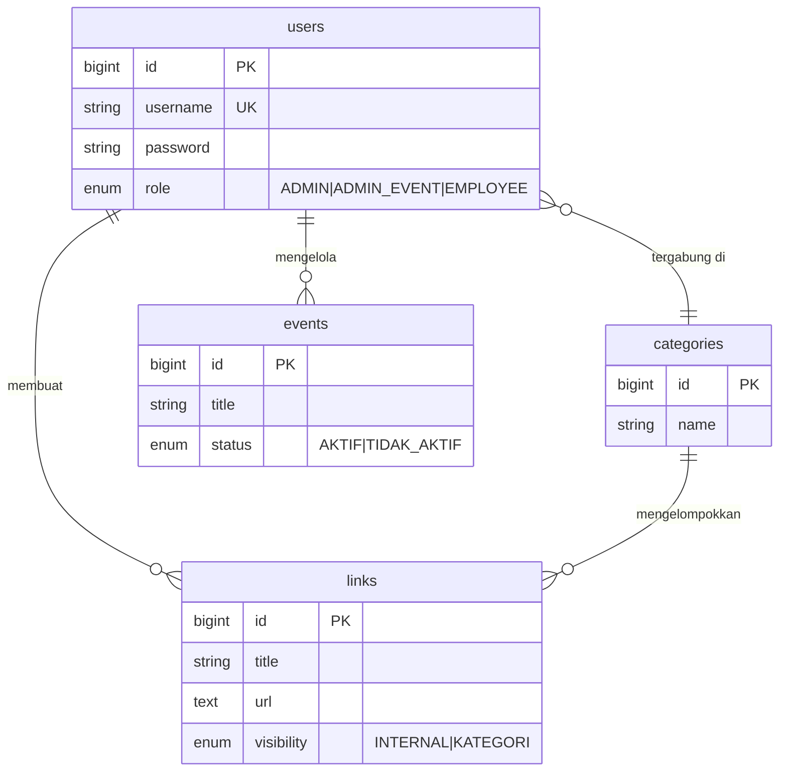

<div align="center">
  
  <br />
  
  
  
  
  
  
  
  <p align="center">
    <strong>SIGAP (Sistem Gerbang Akses Pintar)</strong><br />
    Platform manajemen akses dan landing page terpadu yang didesain khusus untuk stabilitas tinggi di lingkungan shared hosting.
  </p>
</div>

---

## 🛠️ TECHNOLOGICAL STACK

SIGAP dibangun menggunakan kombinasi teknologi modern yang dipilih untuk keseimbangan antara performa tinggi dan kemudahan deployment di lingkungan *Shared Hosting*.

| Komponen | Teknologi | Versi | Keunggulan |
| :--- | :--- | :--- | :--- |
| **Runtime** | PHP | `^8.2` | Keamanan dan efisiensi memori terbaru. |
| **Backend** | **Laravel** | `^11.0` | Framework PHP tercanggih dengan ekosistem keamanan solid. |
| **Frontend** | **Vue.js** | `^3.4` | Reaktivitas instan dan performa UI yang sangat ringan. |
| **Build Tool** | **Vite** | `^6.0` | Proses *Hot Module Replacement* tercepat saat ini. |
| **Styling** | **Tailwind CSS** | `^4.0` | Desain modern dengan performa CSS *zero-runtime* yang bersih. |
| **State Mgmt** | Pinia | `^2.3` | Manajemen state ringan dan terstruktur untuk Vue 3. |

### 💎 KENAPA SIGAP? (KEY ADVANTAGES)

- **🚀 Shared Hosting Ready**: Satu-satunya platform kompleks yang dioptimasi khusus agar berjalan mulus di cPanel tanpa perlu VPS mahal.
- **📦 True Monolith Architecture**: Frontend (Vue) dan Backend (Laravel) dalam satu paket, memudahkan backup dan satu kali push deployment.
- **🛡️ Enterprise Audit Logs**: Setiap aksi (Create/Update/Delete) dicatat otomatis untuk akuntabilitas.
- **🎨 Dynamic Event Editor**: Editor visual real-time untuk membuat microsite event dalam hitungan menit tanpa menyentuh kode.
- **⚡ High-Performance Indexing**: Optimasi query database untuk menangani ribuan klik log tanpa lag.

---

## 🗺️ DIAGRAM DATABASE (ERD)



---

## 👥 I. PANDUAN PERAN (ROLE SOP)

### 📜 Keterangan Peran & Hak Akses

| Fitur | 👑 Admin | 🎭 Admin Event | 💼 Pegawai |
|---|:---:|:---:|:---:|
| Dashboard & Statistik Global | ✅ | ✅ (terbatas) | ✅ (terbatas) |
| Rekap Data CSV | ✅ | ❌ | ❌ |
| Manajemen User (CRUD + Import) | ✅ | ❌ | ❌ |
| Manajemen Kategori | ✅ | ❌ | ✅ |
| **Manajemen Link (CRUD)** | ✅ | ✅ | ✅ |
| **Manajemen Link (Bulk Import)** | ✅ | ❌ | ❌ |
| Manajemen Event (CRUD) | ✅ (semua) | ✅ (sendiri) | ✅ (sendiri) |
| Event Editor (Branding & Fonts) | ✅ | ✅ | ✅ |
| Notifikasi & Feedback | ✅ | ✅ | ✅ |

---

## 🚀 II. PANDUAN DEPLOYMENT (CI/CD)

### 🤖 TAHAP 1: KONFIGURASI GITHUB ACTIONS
Di GitHub -> **Settings** -> **Secrets and variables** -> **Actions**, tambahkan:
- `FTP_SERVER`, `FTP_USERNAME`, `FTP_PASSWORD`.
- `FTP_REMOTE_DIR` (Opsional): Folder tujuan di server (Default: `./`).

### 👨‍🍳 TAHAP 2: ALUR OTOMATIS
Setiap kali Anda menekan `git push origin master`, robot GitHub akan:
1. Menginstall dependensi (Composer & NPM).
2. Membangun Aset (`npm run build`).
3. Mengirimkan file matang ke hosting Anda.

---

## 🔄 III. PANDUAN UPDATE

```bash
cd /jalur/folder/subdomain

# 1. Jalankan migrasi
/opt/alt/php82/usr/bin/php artisan migrate --force

# 2. Optimasi sistem
/opt/alt/php82/usr/bin/php artisan optimize
```

---
*SIGAP v1.0.1 - Performance Hardened Edition*
*Copyright © 2026 wiradika.jr.*
