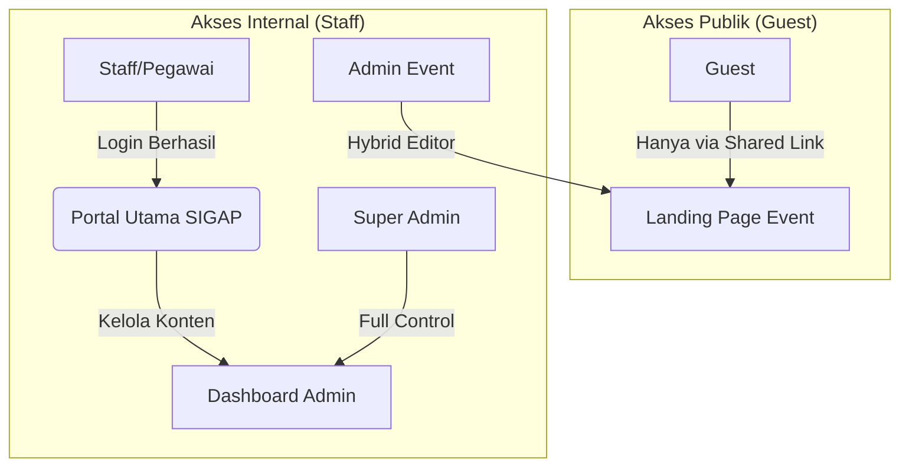
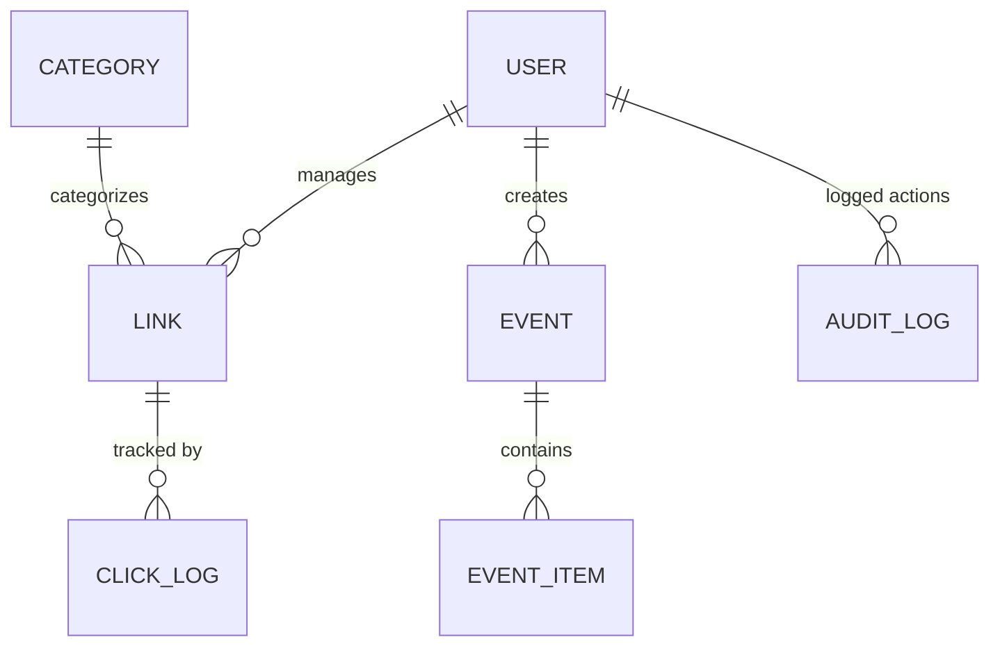
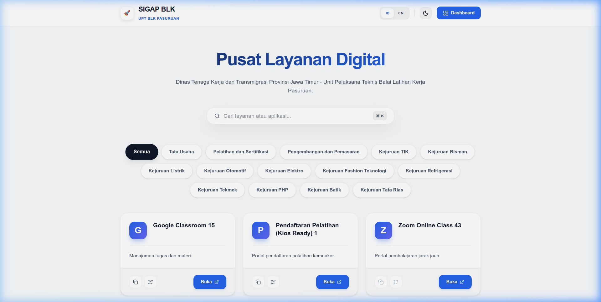
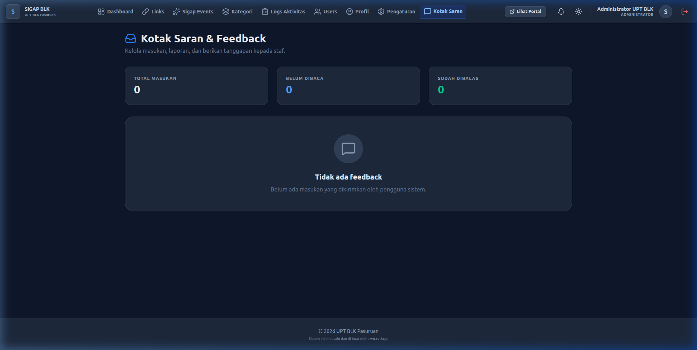
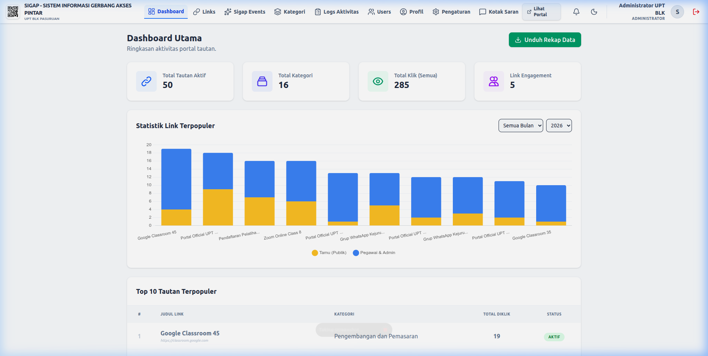
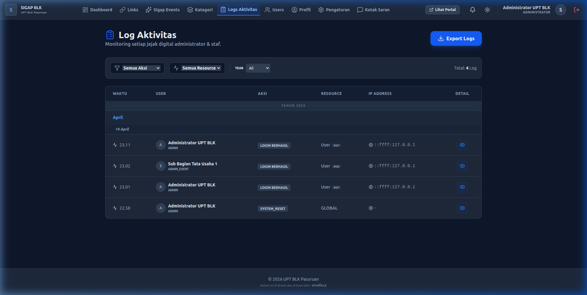
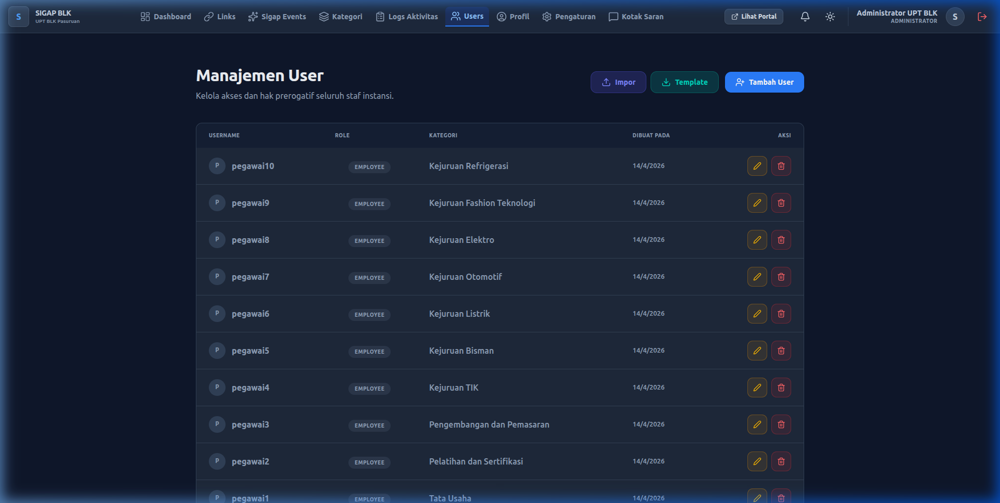
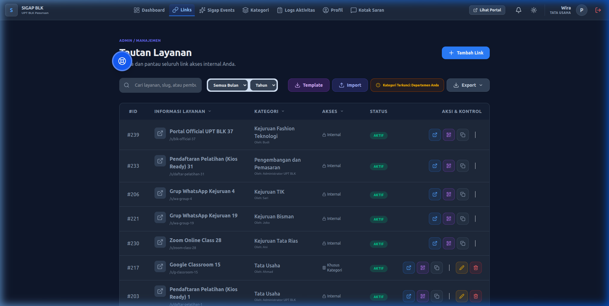
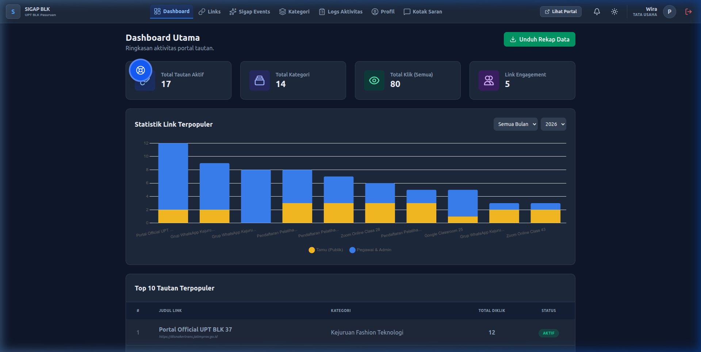
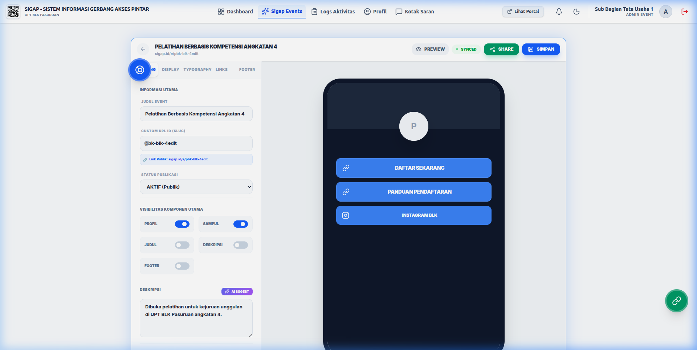

# 🛡️ SIGAP - Sistem Gerbang Akses Pintar (UPT BLK Pasuruan)

[](https://github.com/jarga99/sigap/releases)
[](https://sigap.blkpasuruan.go.id)
[](https://nextjs.org/)
[](https://vuejs.org/)

**SIGAP (Sistem Gerbang Akses Pintar)** adalah platform manajemen portal satu pintu (single-entry gateway) yang digunakan oleh **UPT BLK Pasuruan - Dinas Tenaga Kerja dan Transmigrasi Provinsi Jawa Timur**.

---

## 🏗️ I. Struktur Proyek & Modul
Proyek ini terbagi menjadi dua bagian utama:
- 💻 [**Frontend Client**](./frontend-client) - Framework Vue 3 untuk portal publik dan dashboard.
- ⚙️ [**Backend API**](./backend-api) - Framework Next.js 15 dengan autentikasi robust dan AI Gateway.

---

## 📐 II. Arsitektur & Alur Sistem

### 1. Alur Kerja Utama


### 2. Struktur Database (ERD)


---

## 🚀 III. Fitur Unggulan Berdasarkan Peran

| Role | Fitur Kunci | Deskripsi |
| :--- | :--- | :--- |
| **Super Admin** | **RBAC Monitoring** | Kendali penuh user, audit logs per aksi, dan branding global. |
| **Admin Event** | **Hybrid Editor v2** | Pembuat landing page (Linktree-style) dengan kontrol visual penuh. |
| **Pegawai** | **Link Analytics** | Manajemen shortlink kustom dengan statistik klik real-time. |
| **Guest** | **Feedback Portal** | Sistem pengaduan terintegrasi dengan upload bukti gambar. |

---

## 🎨 IV. Dokumentasi Visual (Galeri Fitur)

### 1. Portal Utama & Feedback (Tamu)
| Beranda Publik | Kotak Saran (Feedback) |
| :--- | :--- |
|  |  |

### 2. Dashboard & Kontrol (Super Admin)
| Statistik Global | Audit Trail (Logs) | Manajemen User |
| :--- | :--- | :--- |
|  |  |  |

### 3. Manajemen Layanan (Pegawai)
| Manajemen Tautan | Statistik Klik |
| :--- | :--- |
|  |  |

### 4. Hybrid Event Editor (v2)

*Alat kustomisasi tampilan landing page event (Warna, Font, Shape, Drag-and-drop).*

---

## 🛠️ V. Panduan Instalasi (Development)

### 📋 Prasyarat
- **Node.js**: v20.x or higher
- **MySQL**: v8.0+
- **NPM/PNPM**

### ⚙️ Alur Setup
1. **Database**: Buat database `sigap_db` di MySQL.
2. **Backend**:
   ```bash
   cd backend-api
   npm install
   cp .env.example .env # Atur DATABASE_URL & JWT_SECRET
   npx prisma db push
   npx prisma db seed # Penting: Gunakan password 'sigap2025'
   ```
3. **Frontend**:
   ```bash
   cd frontend-client
   npm install
   npm run dev
   ```

---

## 🔐 VI. Mekanisme Keamanan & Backup
SIGAP dilengkapi dengan fitur **"Reset Global with Mandatory Backup"**.
- Setiap kali data di-reset, sistem otomatis menjalankan `mysqldump` dan mengompres folder `uploads` menjadi file `.tar.gz`.
- Backup disimpan di folder `/backups/` di root proyek (Terproteksi dari akses publik).

---

## 📚 VII. Dokumentasi & Panduan Resmi
Seluruh panduan operasional tersedia dalam folder [**/docs**](./docs) untuk referensi cepat:

1. 📄 [**DOKUMENTASI_LENGKAP.pdf**](./docs/DOKUMENTASI_SIGAP.pdf) - Panduan lengkap format PDF.
2. 🎤 [**PANDUAN_PRESENTASI.md**](./docs/PRESENTATION_GUIDE.md) - Materi presentasi fitur lengkap.
3. 📖 [**USER_GUIDE.md**](./docs/USER_GUIDE.md) - Panduan penggunaan untuk tiap level user.
4. ⚙️ [**SETUP_GUIDE.md**](./docs/DEMO_SETUP_GUIDE.md) - Panduan teknis instalasi lanjutan.
5. 🛡️ [**SOP_PELINDUNGAN.md**](./docs/PROTECTION_SOP.md) - Standar operasional prosedur keamanan.

---

---

## 🤝 VIII. Kontribusi & Lisensi
Proyek ini dikembangkan secara eksklusif untuk **UPT BLK Pasuruan**. Segala bentuk penggunaan kembali tanpa izin pengembang (`wiradika.jr`) dianggap melanggar hukum hak cipta.

Copyright © 2026 **Sistem Gerbang Akses Pintar (SIGAP)**. Seluruh hak cipta dilindungi undang-undang.

---
*Dikembangkan dengan ❤️ untuk modernisasi layanan publik di Jawa Timur.*
