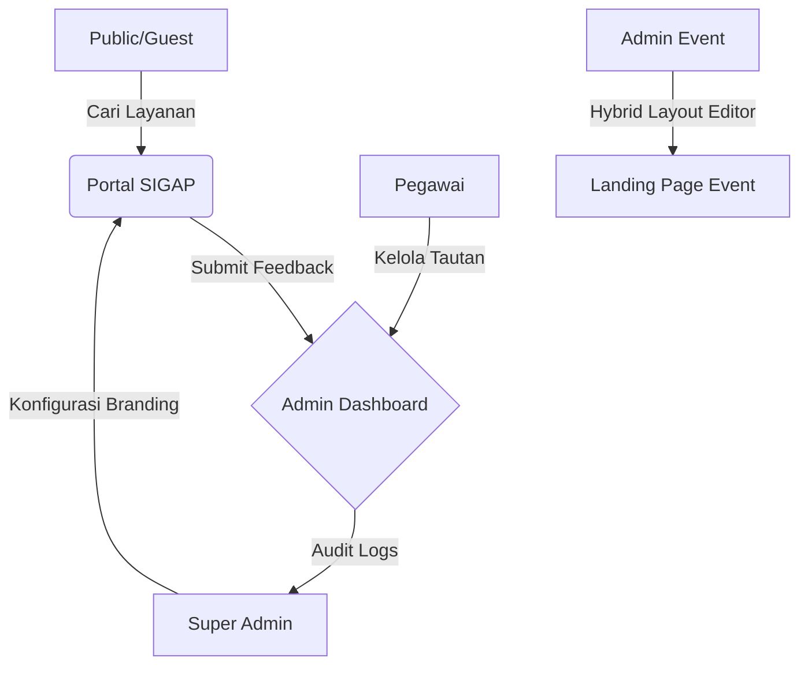
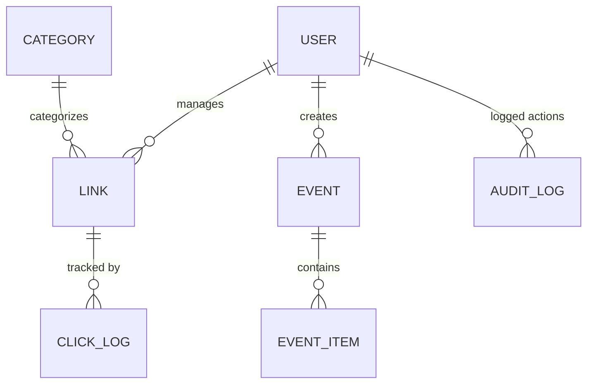

# 🛡️ SIGAP - Sistem Gerbang Akses Pintar

[](https://github.com/jarga99/sigap/releases)
[](https://nextjs.org/)
[](https://vuejs.org/)
[](https://www.typescriptlang.org/)

**SIGAP (Sistem Gerbang Akses Pintar)** adalah platform manajemen portal satu pintu (single-entry gateway) yang dirancang untuk memodernisasi cara instansi mengelola layanan digital, pembuatan shortlink resmi, serta landing page event yang dinamis dan terintegrasi AI.

---

## 🏗️ I. Latar Belakang & Filosofi
Di era digitalisasi, instansi seringkali kesulitan mengelola ratusan link layanan yang tersebar. SIGAP hadir sebagai "Akses Pintar" yang menyatukan seluruh layanan tersebut dalam satu dashboard yang aman, transparan, dan mudah dikelola oleh berbagai peran (Super Admin hingga Pegawai).

---

## 📐 II. Arsitektur & Alur Sistem

### 1. Alur Kerja Utama


### 2. Struktur Database (ERD)


---

## 🚀 III. Fitur Unggulan Berdasarkan Peran

| Role | Fitur Kunci | Deskripsi |
| :--- | :--- | :--- |
| **Super Admin** | **RBAC Monitoring** | Kendali penuh user, audit logs per aksi, dan branding global. |
| **Admin Event** | **Hybrid Editor v2** | Pembuat landing page (Linktree-style) dengan kontrol visual penuh. |
| **Pegawai** | **Link Analytics** | Manajemen shortlink kustom dengan statistik klik real-time. |
| **Guest** | **Feedback Portal** | Sistem pengaduan terintegrasi dengan upload bukti gambar. |

---

## 🎨 IV. Dokumentasi Visual (Screenshots)

### 1. Portal Utama (Guest View)

*Tampilan portal publik untuk mencari layanan instansi.*

### 2. Admin Dashboard (Super Admin)

*Pantauan statistik global seluruh aktivitas sistem.*

### 3. Hybrid Event Editor (v2)

*Alat kustomisasi tampilan landing page event (Warna, Font, Shape, Drag-and-drop).*

---

## 🛠️ V. Panduan Instalasi (Development)

### 📋 Prasyarat
- **Node.js**: v20.x or higher
- **MySQL**: v8.0+
- **NPM/PNPM**

### ⚙️ Alur Setup
1. **Database**: Buat database `sigap_db` di MySQL.
2. **Backend**:
   ```bash
   cd backend-api
   npm install
   cp .env.example .env # Atur DATABASE_URL & JWT_SECRET
   npx prisma db push
   npx prisma db seed # Penting: Gunakan password 'sigap2025'
   ```
3. **Frontend**:
   ```bash
   cd frontend-client
   npm install
   npm run dev
   ```

---

## 🔐 VI. Mekanisme Keamanan & Backup
SIGAP dilengkapi dengan fitur **"Reset Global with Mandatory Backup"**.
- Setiap kali data di-reset, sistem otomatis menjalankan `mysqldump` dan mengompres folder `uploads` menjadi file `.tar.gz`.
- Backup disimpan di folder `/backups/` di root proyek (Terproteksi dari akses publik).

---

## 📘 VII. Panduan Penggunaan (SOP)
Untuk panduan detail per fitur dan per role, silakan baca dokumentasi terpisah kami:
👉 **[SIGAP USER Guide (SOP & Manual)](file:///home/jr/sigap/USER_GUIDE.md)**

---

## ⚖️ VIII. Lisensi & Hak Cipta
Copyright © 2026 **Sistem Gerbang Akses Pintar (SIGAP)**.
Dikembangkan secara eksklusif oleh **wiradika.jr**. Seluruh hak cipta dilindungi undang-undang. Penggunaan tanpa izin tertulis dari pemilik hak cipta dapat dikenakan sanksi sesuai hukum yang berlaku.

---
> Made with 🧪 by SIGAP Dev Team
