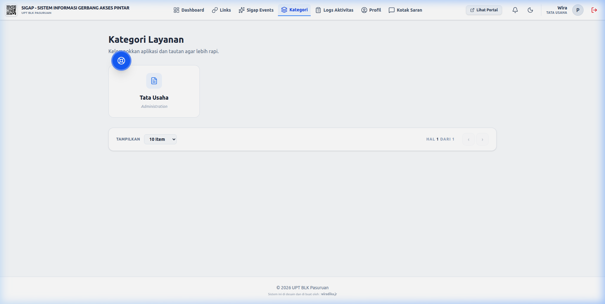

# 📘 Panduan Pengguna SIGAP (SOP & Manual)

Selamat datang di Panduan Pengguna resmi **SIGAP (Sistem Gerbang Akses Pintar)**. Dokumen ini merincikan Standard Operating Procedure (SOP) untuk setiap peran dalam ekosistem SIGAP.

---

## 🔑 I. Panduan Peran (Role SOP)

### 1. 👑 Super Admin (Sistem & Monitoring)
Bertanggung jawab atas stabilitas sistem, manajemen kebijakan pengguna, dan branding instansi.

- **Dashboard Utama**: Melihat anomali statistik dan total klik global.
- **Audit & Security**: Memeriksa **Audit Logs** secara berkala untuk memastikan tidak ada aktivitas mencurigakan.
- **Branding Control**: Mengatur logo, favicon, dan teks footer portal melalui menu pengaturan.
- **Role Control**: Super Admin mengelola seluruh struktur sistem, termasuk fitur Reset Database.

### 2. 🎭 Admin Event (Event Landing Creator)
Bertanggung jawab dalam merancang microsite event yang menarik dan fungsional.

- **Pembuatan Event**: Menentukan judul, deskripsi, dan slug unik untuk event.
- **Hybrid Editor SOP**:
    1. Atur tema warna (Background & Button).
    2. Pilih Google Font yang sesuai dengan branding event.
    3. Tambahkan link pendaftaran, brosur, atau media sosial.
    4. Atur urutan dengan drag-and-drop.
    5. Klik **Simpan** untuk menerapkan perubahan.
    6. Klik **Share** untuk menyalin link publik.
    7. Klik **Preview (Mata)** untuk melihat tampilan langsung di browser.

### 3. 💼 Pegawai (Manajemen Tautan Departemen)
Bertanggung jawab atas pembaruan link layanan di bawah departemennya.

- **Pembuatan Tautan**: Menggunakan slug yang deskriptif (Contoh: `sigap.id/s/form-pns`).
- **Analisis Kinerja**: Memantau grafik statistik klik pada tautan yang dikelola untuk evaluasi bulanan.
- **Manajemen Kategori**: Pegawai diizinkan mengelola kategori tautan untuk mengelompokkan layanan departemen mereka secara mandiri.

---

## 🚀 II. Mekanisme Feedback & Pengaduan (SOP Guest)
Setiap pengunjung dapat memberikan feedback melalui portal utama:
1. Klik tombol melayang (Feedback) atau melalui menu hamburger.
2. Masukkan pesan/laporan kendala.
3. Lampirkan foto bukti (jika ada).
4. Status pengiriman dapat dicek di tab riwayat (jika menggunakan ID yang sama).

---

## 🛠️ III. Pemeliharaan Database (SOP Admin)
Untuk menjaga performa sistem, Super Admin disarankan melakukan reset data operasional secara berkala (Setiap awal tahun anggaran).
- **Prosedur**: Masuk ke Pengaturan Sistem -> Tab Database -> Klik **Reset All Data**.
- **Hasil**: Sistem akan otomatis mengunduh file backup `.tar.gz` sebelum menghapus data.

---

## 🔗 IV. Membagikan Link Event (Share Link)
Untuk membagikan Event yang sudah Anda buat ke publik:
1. Buka **Event Editor** untuk event pilihan Anda.
2. Pastikan status event adalah **AKTIF** (di tab Branding).
3. Klik tombol **Share (Ijo/Emerald)** di pojok kanan atas.
4. Link akan tersalin otomatis. Bagikan link tersebut (Contoh: `sigap.id/e/nama-event`) melalui WhatsApp or media sosial lainnya.

> [!NOTE]
> Link hanya bisa diakses oleh publik jika statusnya **AKTIF**. Jika statusnya INAKTIF, Guest akan menerima pesan error 404.

---

## 🧪 V. Simulasi & Validasi Peran (Role Checking)
Untuk memastikan sistem berjalan sesuai alur, Anda dapat melakukan pengetesan menggunakan akun demo berikut:

### 1. 🛡️ Uji Coba Super Admin
- **Username**: `sigap_admin`
- **Tujuan**: Verifikasi akses ke menu Manajemen User, Pengaturan Instansi, dan Audit Logs.
- **Ekspektasi**: Semua menu terlihat dan dapat diakses.

### 2. 🎭 Uji Coba Admin Event
- **Username**: `admin_event1`
- **Tujuan**: Verifikasi pemblokiran menu Kategori dan akses ke Event Editor.
- **Ekspektasi**: Menu Kategori **hilang** atau menunjukkan "Forbidden (403)". Halaman Event Editor menampilkan tombol **Share** & **Preview**.

### 3. 💼 Uji Coba Pegawai
- **Username**: `pegawai1`
- **Tujuan**: Verifikasi akses manajemen Kategori dan Link Internal.
- **Ekspektasi**: Menu Kategori **tersedia**. Dashboard hanya menunjukkan statistik link internal.

---

> SIGAP User Manual v1.0.0
